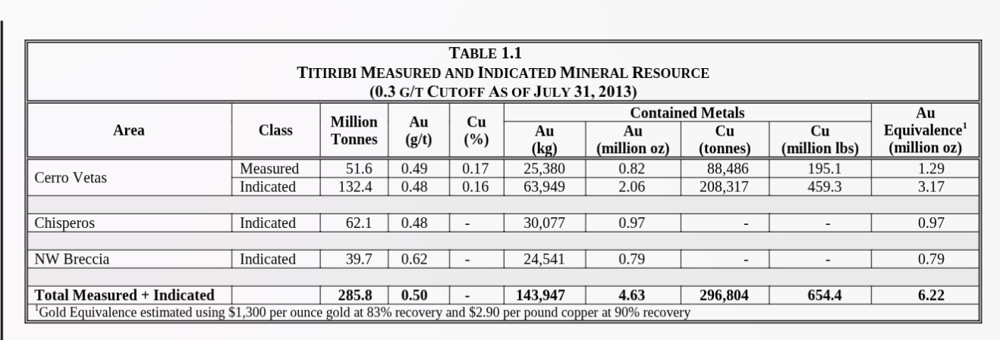

# Conclusiones

- En varias tablas hay filas por area/zona y una fila total (p. ej. "Total Measured + Indicated"); se conservan ambas y se evita doble conteo en analisis.
- Si el reporte indica "no reserves" o "costs not determined", se deja el campo vacio y se registra advertencia; no se inventan datos.
- Las unidades y valores se guardan tal cual (raw + unit) sin conversiones para mantener trazabilidad.
- La trazabilidad se soporta con source_pages y el run_manifest/coverage_report para auditar que pagina origina cada dato.
- El enfoque two-stage prioriza paginas relevantes y reduce costo; embeddings/retries mejoran cobertura pero elevan tiempo y gasto.
- Las filas combinadas (Measured+Indicated, Proven+Probable) se guardan como su propia categoria ademas de las filas por clase.
